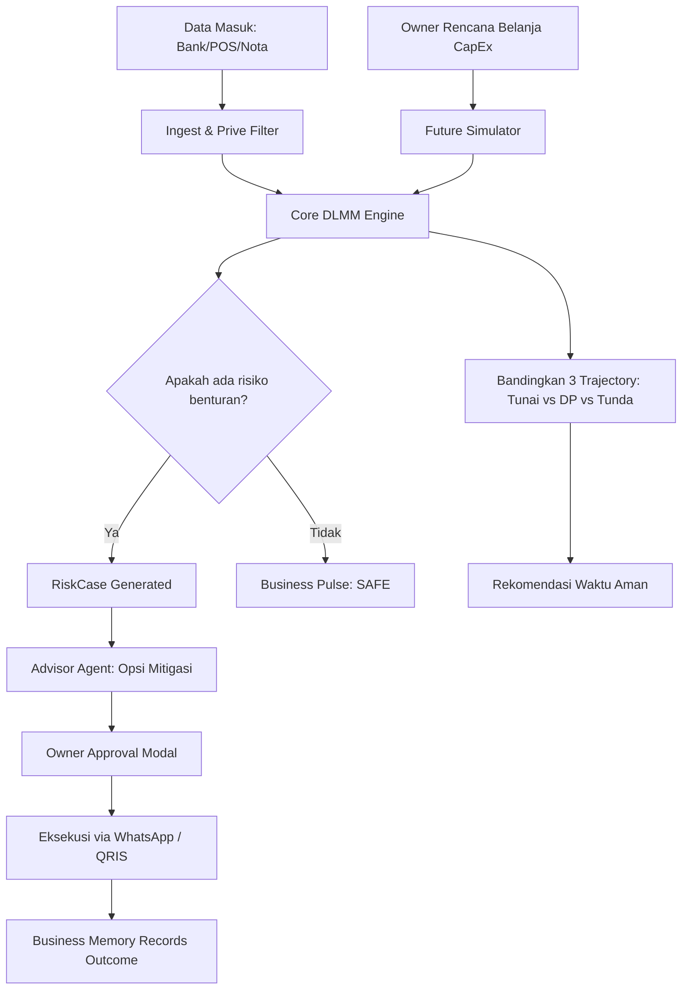
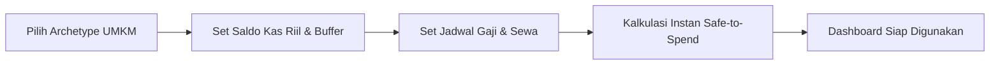

# JagaUsaha — Master Architecture & Product Logic Plan
> **AI Autonomous Business Guardian & Decision Sandbox for Indonesian UMKM**  
> *Target: AI HackFest 2026 (IDwebhost × AICLUB.ID)*

---

## 1. PRODUCT NORTH STAR

> **"JagaUsaha adalah Guardian Bisnis Otonom berbasis matematis deterministik yang menjaga kelangsungan hidup kas UMKM: memetakan realitas finansial dari data seadanya, mengendus kebocoran dan benturan kas sebelum terjadi, menguji skenario belanja modal secara aman (*Safe-to-Spend*), dan mendampingi pemilik usaha mengambil tindakan taktis tanpa beban akuntansi yang rumit."**

Bagi pemilik UMKM Indonesia, tantangan terbesar bukanlah membuat laporan laba rugi akhir tahun, melainkan menjawab pertanyaan harian yang mencemaskan: *"Apakah uang saya aman untuk bayar gaji akhir bulan kalau saya belanja hari ini?"* JagaUsaha mengubah data mentah (mutasi bank, foto nota, chat WhatsApp, atau estimasi kasar) menjadi **Business Digital Twin** yang hidup dan proaktif melindungi bisnis 24/7.

---

## 2. ACTORS

1. **Owner (Pemilik Usaha / Decision Maker)**:
   - Pengambil keputusan tunggal; bukan akuntan.
   - Menginginkan kejelasan instan (Hijau/Kuning/Merah), nominal Safe-to-Spend yang pasti, dan rekomendasi 1-klik via WhatsApp.
2. **Staff / Cashier / Barista (Operator Toko)**:
   - Aktor sekunder tanpa akses ke metrik laba bersih/prive.
   - Hanya mengirim data operasional: foto struk belanja pasar, bon supplier, atau input kas harian via WhatsApp/Web Form ringkas.
3. **Deterministic Core Engine (DLMM - Dynamic Liquidity Management Model)**:
   - Mesin komputasi matematis native Python 3.11 murni.
   - **Aturan Mutlak**: LLM dilarang keras melakukan penjumlahan, pengurangan, atau proyeksi nominal kas. Seluruh saldo kas, runway, aging piutang, dan *Safe-to-Spend* dihitung 100% deterministik tanpa halusinasi.
4. **Autonomous AI Agents (Hermes Agent Runtime)**:
   - **Sensor Agent**: Mengingest, mengekstrak OCR dokumen, mendeteksi anomali prive, dan menormalisasi data ke canonical model.
   - **Simulator Agent**: Mengorkestrasi parameter *what-if scenario*, stress testing, dan menyusun perbandingan trajectory.
   - **Advisor Agent**: Merangkai narasi rekomendasi empati, menyusun draf penagihan/negosiasi berbahasa Indonesia santun, dan mengelola *Data Inbox*.
5. **External Data Sources**:
   - Bank Central Asia (BCA API / Mutasi Parser CSV/PDF).
   - POS Exports (Moka, Pawoon, Majoo, Kasir Pintar).
   - Messaging & Vision (WhatsApp Multi-device API, Gemini Vision OCR).

---

## 3. END-TO-END USER JOURNEY

```
[ Hari ke-0: Pendaftaran Kilat ]
  ↓ Input 3 parameter (Tipe Usaha, Kas Riil, Tanggal Gajian) tanpa form akuntansi rumit.
[ Menit ke-5: Initial Business Checkup ]
  ↓ First Value Moment: Mendapatkan angka "Duit Dingin Aman" pertama kali.
[ Hari ke-1–7: Pengumpulan Pasif & Data Inbox ]
  ↓ Mutasi bank masuk, struk difoto via WA, transaksi ambigu masuk "Data Inbox" (1-klik konfirmasi).
[ Minggu ke-2: Deteksi Kebocoran / Benturan ]
  ↓ Guardian Engine mengendus kenaikan HPP cup plastik 22% & benturan jatuh tempo H+6.
[ Minggu ke-3: Simulasi Keputusan Strategis ]
  ↓ Owner ingin beli mesin: "Aman nggak?". Simulator menguji 3 skenario (Tunai vs DP 50% vs Tunda).
[ Minggu ke-4: Evaluasi Hasil & Business Memory ]
  ↓ Keputusan tersimpan. Sistem mengukur realitas vs prediksi: "Tindakan DP 50% menyelamatkan kas Rp 7 Jt".
[ Bulan ke-2+: Adaptive Guardian ]
  ↓ Threshold risiko menyesuaikan musiman; sistem semakin cerdas menjaga bisnis layaknya CFO pribadi.
```

---

## 4. NEW USER ONBOARDING FLOW (PROGRESSIVE DISCLOSURE)

Target utama: **First Useful Insight dalam 3–5 Menit**. Tidak ada setup bagan akun (Chart of Accounts) atau debit/kredit.

### Step 1: Identitas Bisnis & Archetype
- **Nama Usaha**: (misal: "Kopi Nusa")
- **Pilihan Archetype Industri (1-Klik)**:
  * `☕ Kafe & F&B`: Perputaran harian, bahan baku basah, konsentrasi gajian tgl 25–30.
  * `🛍️ Retail / Olshop`: Perputaran stok musiman, jeda pencairan COD/marketplace H+3.
  * `🛒 Warung / Kelontong`: Margin tipis (10–15%), tempo supplier sembako 7–14 hari.
  * `💼 Jasa & Agensi`: Piutang termin (DP 50% + Pelunasan 30 hari), beban utama gaji tim.
* *Efek Sistem*: Memilih archetype otomatis memuat **baseline parameter default** industri, sehingga AI langsung memahami ritme kas tanpa data historis.

### Step 2: Pilih Metode Input Data (Fleksibel & Anti-Gagal)
1. **Opsi A — Impor Data Riil (Bagi yang sudah rapi)**:
   - Upload Excel POS (Moka/Majoo/Pawoon) atau Rekening Koran BCA (PDF/CSV).
2. **Opsi B — Foto Dokumen / Nota Terakhir**:
   - Jepret 1–3 struk belanja supplier atau rekap kasir harian.
3. **Opsi C — Quick Business Check (Bagi yang belum punya catatan sama sekali)**:
   - Hanya 3 angka: (1) Saldo Kas Sekarang, (2) Pengeluaran Gaji & Sewa, (3) Estimasi Omset/Hari.
4. **Opsi D — Percakapan Santai (Chat with JagaUsaha)**:
   - Owner mengetik/mengirim suara: *"Omset saya sekitar 45 juta, pegawai 4 orang total 8 juta, ada utang bahan 4 juta minggu depan."*
   - Sensor Agent mengekstrak entitas dan menyodorkan kartu verifikasi: `[Konfirmasi]` / `[Edit]`.

### Step 3: Penetapan Data Confidence & First Baseline
- Sistem menghitung Skor Kelengkapan Data:
  * `Verified Data (Hijau)`: Berasal dari mutasi rekening bank atau struk OCR valid.
  * `Estimated Data (Kuning)`: Berasal dari estimasi owner saat onboarding.
  * `Inferred Data (Biru)`: Diturunkan dari benchmark archetype industri.
- Angka estimasi diberi tanda transparan: `Rp 3.800.000 (Estimasi Awal · Confidence Medium)`.

---

## 5. DATA INGESTION FLOW (CANONICAL PIPELINE)

```
[ Sumber Mentah ] (CSV / Bank PDF / Foto Nota / Chat WA)
       ↓
[ Ingestion & Sanitation ] (Validasi format, deteksi encoding UTF-8, pembersihan noise)
       ↓
[ Parser & Field Extraction ] (Kolom POS auto-mapping / OCR bounding-box extraction)
       ↓
[ Prive & Category Separation ] (Klasifikasi: Operasional Toko vs Tarikan Pribadi Owner)
       ↓
[ Duplicate & Conflict Check ] (Pencocokan mutasi bank vs nota kasir agar tidak tercatat ganda)
       ↓
[ Data Inbox (Jika Confidence < 85%) ] → Owner verifikasi 1-klik di UI
       ↓
[ Normalized Ledger Event ] → Masuk ke Canonical Business Database (PostgreSQL)
       ↓
[ DLMM State Re-computation ] → Update Business Digital Twin secara deterministik
```

### Detail Per Sumber Data:
1. **POS Excel/CSV**:
   - Kolom dipetakan secara heuristik: `tanggal -> transaction_date`, `subtotal/total -> gross_revenue`, `metode -> payment_channel`.
   - Pola mapping disimpan permanen untuk batch upload berikutnya.
2. **Bank Statement (Rekening Koran)**:
   - Auto-rule untuk mutasi keluar:
     * Transfer ke pemilik/rekening pribadi -> diklasifikasikan sebagai `OWNER_DRAW (Prive)`, **diisolasi agar tidak merusak HPP usaha**.
     * Transfer berulang nominal tetap -> diklasifikasikan sebagai `RECURRING_OBLIGATION` (Gaji/Sewa).
     * Transaksi tidak dikenal -> Masuk ke **Data Inbox**.
3. **Foto Nota / Struk**:
   - Vision OCR mengekstrak: Toko/Vendor, Tanggal, Item, Total Nominal.
   - Jika foto buram, jangan menebak; beri tahu owner: *"Nominal nota Toko Makmur kurang jelas, apakah benar Rp 450.000?"*.

---

## 6. CANONICAL BUSINESS DATA MODEL

Entitas minimal yang esensial, kokoh, dan bebas beban akuntansi ganda:

```
┌─────────────────┐       ┌────────────────────┐       ┌──────────────────┐
│    Business     │───1:N─│  BusinessProfile   │───1:N─│   CashAccount    │
│ (ID, Name, Type)│       │(Archetype, Buffer) │       │ (Bank, Balance)  │
└─────────────────┘       └────────────────────┘       └──────────────────┘
         │                          │
        1:N                        1:N
         │                          │
┌─────────────────┐       ┌────────────────────┐       ┌──────────────────┐
│   Transaction   │───1:N─│BusinessObligation  │       │     RiskCase     │
│(Date, Net, Type)│       │ (DueDay, Recurring)│       │(Severity, State) │
└─────────────────┘       └────────────────────┘       └──────────────────┘
         │                                                      │
        1:N                                                    1:N
         │                                                      │
┌─────────────────┐                                    ┌──────────────────┐
│ TransactionItem │                                    │  Recommendation  │
│ (Qty, COGS, SKU)│                                    │(Action, Impact)  │
└─────────────────┘                                    └──────────────────┘
                                                                │
                                                               1:1
                                                                │
                                                       ┌──────────────────┐
                                                       │  BusinessMemory  │
                                                       │(Outcome, Lessons)│
                                                       └──────────────────┘
```

1. **Business**: ID, nama legal/merek, tanggal berdiri, timezone.
2. **BusinessProfile**: Archetype industri, safety buffer minimum, rata-rata omset harian baseline, data maturity level (0–4).
3. **CashAccount**: Sumber likuiditas (BCA, Mandiri, Kas Kasir, Saldo QRIS).
4. **Transaction**: Mutasi riil (inflow/outflow), status verifikasi (Verified, Estimated, Inferred), kategori (Revenue, COGS, Opex, Prive, Transfer).
5. **BusinessObligation**: Komitmen kas mendatang (Gaji, Tempo Bahan Baku, Cicilan Alat, Sewa Ruko).
6. **RiskCase**: Berkas risiko aktif yang mendeteksi ancaman kas (misal: "Cash Pressure H+6").
7. **Recommendation**: Opsi mitigasi operasional konkret dengan kalkulasi dampak rupiah.
8. **BusinessMemory**: Riwayat keputusan pemilik usaha beserta realisasi dampaknya di masa depan.

---

## 7. BUSINESS STATE MODEL (THE DIGITAL TWIN)

Kondisi bisnis disimpan dalam satu representasi memori terstruktur (*Snapshot State*):

```typescript
interface BusinessDigitalTwin {
  business_id: string;
  timestamp: string;
  data_confidence: 'HIGH' | 'MEDIUM' | 'LOW';
  
  // 1. Likuiditas Riil
```

---

## 8. FINANCIAL METRICS ENGINE (DETERMINISTIC & TRANSPARENT)

Seluruh metrik dihitung dalam service Python murni (`core/dlmm.py`). **LLM dilarang menghitung angka.**

| Metrik | Formula Matematis | Input Data | Output & Unit | Fallback Saat Data Kurang |
| :--- | :--- | :--- | :--- | :--- |
| **Safe-to-Spend (Duit Dingin)** | $S = C_{now} - \sum_{i=1}^{W} O_i - B_{safety} + \alpha \sum_{i=1}^{W} R_i$ | Saldo kas ($C_{now}$), Komitmen $W=14$ hari ($O_i$), Buffer ($B_{safety}$), Piutang pasti ($R_i, \alpha=0.7$) | Nominal (Rp) | Hitung sederhana: $C_{now} - O_{gaji} - B_{safety}$ (Beri label *Estimated*) |
| **Cash Runway** | $Runway = \frac{C_{now} - B_{safety}}{Burn_{daily}}$ | Saldo kas, buffer, rata-rata burn harian 30 hari | Jumlah Hari (Hari) | Gunakan asumsi rata-rata Opex bulanan / 30 |
| **Operating Margin** | $Margin = \frac{Revenue - COGS - Opex}{Revenue} \times 100\%$ | Rekap omset, belanja bahan baku (COGS), beban operasional | Persentase (%) | Tampilkan: *"Belum dapat dihitung karena data HPP/nota bahan belum diinput"* |
| **Prive Leakage Ratio** | $Ratio = \frac{\sum Prive}{Gross\,Profit} \times 100\%$ | Mutasi keluar berkategori `OWNER_DRAW` vs Laba Kotor | Persentase (%) | Jika laba kotor tidak ada, bandingkan terhadap total omset kotor |
| **Receivable Clashing Index** | $Clash = \min_{t} (C(t) - B_{safety})$ di mana $C(t) = C_{now} + \int (In - Out) dt$ | Trajektori harian 30 hari terhadap jadwal jatuh tempo | Hari benturan ($H+n$) & Nominal defisit (-Rp) | Evaluasi tanggal komitmen terdekat vs saldo bank hari ini |

---

## 9. DATA CONFIDENCE MODEL (PROVENANCE & INTEGRITY)

JagaUsaha tidak pernah mencampur data pasti dengan perkiraan tanpa label jelas:

1. **Level 1 — VERIFIED (High Confidence - 90-100%)**:
   - Ditarik langsung dari API/Mutasi Bank BCA, export CSV kasir POS resmi, atau struk belanja terverifikasi OCR lengkap.
   - Digunakan sebagai jangkar keras saldo kas dan tanggal komitmen.
2. **Level 2 — ESTIMATED (Medium Confidence - 60-89%)**:
   - Dinyatakan langsung oleh pemilik usaha (misal: "Rata-rata omset harian sekitar 900 ribu").
   - Digunakan untuk memproyeksikan inflow harian, namun tidak boleh dipakai untuk mengklaim laba bersih pasti.
3. **Level 3 — INFERRED (Low Confidence - 30-59%)**:
   - Diturunkan dari benchmark archetype industri (misal: rasio HPP F&B diasumsikan 38%).
   - Hanya digunakan untuk skenario stres testing darurat dan rekomendasi umum.

---

## 10. GUARDIAN MONITORING ENGINE (THE CONTINUOUS LOOP)

```
[ Event Data Masuk ] (Mutasi BCA baru / Nota diupload / Omset harian selesai)
       ↓
[ 1. State Recalculation ] (Core DLMM menghitung ulang metrik: Runway, Safe-to-Spend, Buffer)
       ↓
[ 2. Baseline Comparison ] (Bandingkan metrik hari ini terhadap Moving Average 14 Hari)
       ↓
[ 3. Signal Trigger Check ] (Evaluasi aturan threshold: Defisit, Kenaikan HPP, Keterlambatan)
       ↓
[ 4. Signal Correlation & Deduplication ] (Gabungkan sinyal-sinyal terkait ke 1 RiskCase tunggal)
       ↓
[ 5. Agent Investigation ] (Sensor & Simulator menganalisis akar masalah & menghitung dampak)
       ↓
[ 6. Suppression Check ] (Cegah spam: Jangan notifikasi jika risiko identik sudah diakui dalam 7 hari)
       ↓
[ 7. Action Dossier Creation ] (Susun ringkasan: Fakta -> Dampak -> Opsi Tindakan 1-Klik)
       ↓
[ 8. Delivery to Owner ] (Muncul di Business Pulse Dashboard & WhatsApp Alert jika Urgent)
```

---

## 11. SIGNAL → RISK LOGIC (DARI ANOMALI KE RISIKO BERMAKNA)

JagaUsaha menolak "AI Alert Fatigue" (mengirim 5 notifikasi terpisah untuk hal kecil). Sistem mengelompokkan sinyal-sinyal kecil menjadi satu **Kasus Risiko Berdampak Finansial**:

| Sinyal Terdeteksi | Korelasi Latar Belakang | Kasus Risiko Terbentuk (*RiskCase*) | Keparahan (*Severity*) | Penjelasan Guardian & Opsi Mitigasi |
| :--- | :--- | :--- | :--- | :--- |
| • Penjualan -10% seminggu<br>• Stok bahan baku menumpuk<br>• Jatuh tempo supplier H+8 | Kas menipis sementara kewajiban supplier Rp 7.8 Jt mendekat | **BENTURAN KAS OPERASIONAL (Cash Pressure Developing)** | 🔴 **CRITICAL** | *"Penjualan melambat saat tagihan bahan baku Rp 7.8 Jt jatuh tempo 8 hari lagi. Saldo kas berisiko jebol Rp 3.2 Jt di bawah batas aman."*<br>👉 Opsi: Ajukan DP 50% via WhatsApp / Tagih piutang katering H+3. |
| • Pengeluaran packaging naik 28%<br>• Omset stabil/flat | Vendor menaikkan harga satuan cup tanpa disadari owner | **KEBOCORAN BIAYA PASIF (Silent Cost Leak)** | 🟡 **WARNING** | *"Biaya packaging naik Rp 1.1 Jt/bulan padahal jumlah cup terjual sama."*<br>👉 Opsi: Rekomendasi negosiasi vendor alternatif / sesuaikan harga varian tertentu. |
| • Mutasi transfer keluar ke rekening pribadi meningkat | Penarikan dana pribadi toko tanpa pencatatan prive | **PENYEDOTAN KAS PRIVE (Prive Capital Drain)** | 🟡 **WARNING** | *"Penarikan kas pribadi mencapai Rp 3.8 Jt bulan ini (melebihi 40% laba operasional)."*<br>👉 Opsi: Pisahkan rekening operasional & kunci kuota prive bulanan. |

---

## 12. FEATURE FLOWS (SPESIFIKASI 10 FITUR UTAMA)

### 1. Business Pulse (Homepage Keamanan Kas)
- Tidak menampilkan grafik rumit yang membingungkan.
- Menjawab 1 pertanyaan: *"Apakah bisnis saya aman hari ini?"*
- Status kromatik tunggal: **AMAN (Safe) · STABIL (Stable) · WASPADA (Watch) · SIAGA (At Risk) · KRITIS (Critical)**.
- Menampilkan 4 pilar instan: Saldo Kas Nyata, Duit Dingin Aman (*Safe-to-Spend*), Runway Operasional, dan Agenda Jatuh Tempo 14 Hari.

### 2. Guardian Feed (Pusat Intervensi & Berkas Kasus)
- Daftar kronologis kartu risiko yang terdeteksi otomatis.
- Setiap kartu memiliki format **3 Anatomi Tindakan**:
  1. *Fakta Objektif*: Apa yang terjadi beserta buktinya.
  2. *Dampak Matematis*: Berapa juta kas yang terancam dalam berapa hari.
  3. *Tombol Tindakan Cepat*: [Ajukan DP 50% via WA] / [Tagih Invoice QRIS] / [Abaikan].

### 3. Silent Leak Detector (Detektor Kebocoran Kas Halus)
- Melacak pergeseran biaya vendor kumulatif secara diam-diam.
- Mengidentifikasi biaya langganan software tak terpakai, selisih harga bahan baku per kg, dan pemborosan operasional yang biasanya luput dari buku kas manual.

### 4. Safe-to-Spend Calculator (Duit Dingin Aman Belanja)
- Formula deterministik anti-gagal bayar.
- Memberitahu owner: dari total uang Rp 18.5 Jt di bank, hanya **Rp 3.8 Jt** yang boleh dipakai belanja bebas. Sisanya adalah hak gaji karyawan (Rp 7.5 Jt), tempo bahan baku (Rp 4.2 Jt), dan cadangan besi darurat (Rp 3.0 Jt).

### 5. Future Simulator (Decision Sandbox)
- Wadah eksperimen belanja modal (CapEx) tanpa risiko:
  * Owner memasukkan rencana: *"Beli Mesin Espresso Rp 14 Jt"*.
  * Sistem membandingkan 3 kurva:
    1. **Skenario A (Tunai Sekarang)**: Kas defisit -Rp 3.0 Jt pada tanggal 30 (Gagal bayar gaji barista).
    2. **Skenario B (DP 50% + Tempo 30 Hari)**: Saldo kas terendah tetap Rp 4.5 Jt (Aman 100%).
    3. **Skenario C (Tunda 4 Minggu)**: Saldo kas stabil Rp 8.2 Jt sebelum beli.
  * Hasil: Rekomendasi objektif dan draf pesan negosiasi WhatsApp ke vendor.

### 6. Business Fire Drill (Uji Ketahanan Krisis Otomatis)
- Uji stres otomatis bulanan:
  * *"Bagaimana jika omset turun 20% selama 2 bulan?"*
  * *"Bagaimana jika 1 pelanggan katering terbesar gagal bayar invoice?"*
- Menghasilkan peta ketahanan hari (*Survival Horizon Days*).

### 7. Pre-Mortem Analyzer (Simulasi Sebab-Akibat 6 Bulan ke Depan)
- Memetakan rantai kegagalan bisnis jika sinyal bahaya saat ini dibiarkan:
  `Penjualan turun -> Stok menumpuk -> Kas terkunci di barang -> Gagal bayar supplier -> Operasional terganggu`.
- Memberikan 3 simpul intervensi: *"Putuskan rantai di titik stok bahan baku sekarang"*.

### 8. Business Memory (Memori Pengalaman Keputusan & Outcome)
- Mencatat setiap keputusan strategis yang diambil owner dan memverifikasi dampaknya 30-60 hari kemudian.
- Contoh: *"Bulan lalu owner memilih skema DP 50% untuk mesin kopi. Hasil nyata: Kas operasional berhasil melewati gajian tanpa pinjaman online. Pengalaman ini tersimpan sebagai referensi jika owner ingin belanja alat lagi."*

### 9. Data Inbox (Kotak Masuk Rekonsiliasi Ragu-Ragu)
- Wadah untuk transaksi ambigu dengan akurasi <85%.
- Owner cukup memilih 1 dari 4 tombol: `[Beban Usaha]` / `[Beli Stok]` / `[Prive Pribadi]` / `[Transfer Antar-Rekening]`.
- AI belajar dari konfirmasi ini dan mengotomatiskan transaksi serupa di masa depan.

### 10. Ask JagaUsaha (Asisten Konsultasi Finansial Kontekstual)
- Dialog percakapan yang memahami seluruh isi Digital Twin bisnis.
- Tidak pernah berhalusinasi: jawaban didasarkan pada angka riil yang dihitung oleh Core DLMM.

---

## 13. AGENT ARCHITECTURE (HERMES RUNTIME SPECIFICATION)

Sistem menggunakan **Orkestrasi 3 Agen Fungsional Ringan** untuk efisiensi latensi dan biaya komputasi di CloudBaik VPS:

```
┌─────────────────────────────────────────────────────────────┐
│                 GUARDIAN ORCHESTRATOR                       │
│    (Menerima event data, mengontrol lifecycle analisis)    │
└──────────────────────────────┬──────────────────────────────┘
                               │
       ┌───────────────────────┼───────────────────────┐
       ▼                       ▼                       ▼
┌──────────────┐       ┌──────────────┐       ┌──────────────┐
│ SENSOR AGENT │       │SIMULATOR AGT │       │ADVISOR AGENT │
│• Ingest data │       │• Setting skenario    │• Narasi empati│
│• Vision OCR  │       │• Stress test │       │• Draf WhatsApp
│• Prive filter│       │• Peta runway │       │• Rekomendasi │
└──────┬───────┘       └──────┬───────┘       └──────┬───────┘
       │                      │                      │
       └──────────────────────┼──────────────────────┘
                              ▼
               ┌─────────────────────────────┐
               │    DLMM DETERMINISTIC CORE  │
               │ (Perhitungan matematis 100% │
               │   tanpa dependensi LLM)     │
               └─────────────────────────────┘
```

1. **Sensor Agent**:
   - *Tools*: `parse_bank_statement`, `ocr_receipt`, `classify_prive`, `clean_csv`.
   - *Tugas*: Membaca data mentah, membersihkan duplikat, dan mengisolasi uang pribadi.
2. **Simulator Agent**:
   - *Tools*: `simulate_trajectory`, `calculate_safe_to_spend`, `run_stress_scenarios`.
   - *Tugas*: Mengirim parameter ke engine DLMM dan menerima matriks kurva 30 hari.
3. **Advisor Agent**:
   - *Tools*: `compose_whatsapp_draft`, `generate_qr_paylink`, `retrieve_business_memory`.
   - *Tugas*: Mengubah matriks risiko teknis menjadi bahasa bisnis santun dan draf WhatsApp siap kirim.

---

## 14. HUMAN APPROVAL & FINANCIAL SAFETY TIERS

JagaUsaha mematuhi prinsip **Non-Custodial Financial Safety**:

- **LEVEL 0 (OBSERVE - Otomatis Penuh)**: Menghitung metrik, membaca mutasi bank, mendeteksi anomali.
- **LEVEL 1 (ASSIST - Otomatis Terbatas)**: Menyusun ringkasan mingguan, menyortir Data Inbox, menghitung ulang Safe-to-Spend.
- **LEVEL 2 (PROPOSE - Membutuhkan Persetujuan 1-Klik Owner)**:
  * Menyiapkan draf pesan WhatsApp ke supplier atau pelanggan.
  * Mengubah baseline anggaran belanja modal.
  * Menandai transaksi di Data Inbox sebagai Prive.
- **LEVEL 3 (EXECUTION - Dilarang Keras Dijalankan Otomatis oleh AI)**:
  * AI dilarang mentransfer uang, mengambil pinjaman kredit, atau membayar invoice secara sepihak.
  * Seluruh eksekusi moneter berada 100% di tangan pemilik usaha melalui m-Banking resmi mereka.

---

## 15. STATE MACHINES

### A. RiskCase Lifecycle
```
[ DETECTED ] ──(Kalkulasi korelasi DLMM)──> [ INVESTIGATING ]
                                                    │
                                             (Validasi keparahan)
                                                    ▼
[ DISMISSED ] <──(Abaikan/False Pos)── [ VALIDATED & NOTIFIED ]
                                                    │
                                            (Ajukan intervensi)
                                                    ▼
                                           [ ACTION_PROPOSED ]
                                                    │
                                           (Owner menyetujui)
                                                    ▼
[ RESOLVED ] <──(Dampak terverifikasi)── [ MONITORING OUTCOME ]
```

### B. Recommendation Lifecycle
`DRAFT -> READY -> PRESENTED -> ACCEPTED / REJECTED / DEFERRED -> COMPLETED -> OUTCOME_MEASURED (Business Memory)`

### C. DataInbox Item Lifecycle
`UNRESOLVED -> OWNER_PROMPTED -> CLASSIFIED (Business/Prive/Supplier/Transfer) -> MERGED_TO_LEDGER -> RULE_LEARNED`

---

## 16. MERMAID FLOW DIAGRAMS

### Diagram 1: Continuous Guardian & Decision Simulation Loop


### Diagram 2: Cold-Start Onboarding Flow (Zero Historical Data)


---

## 17. UI SCREEN MAP (INFORMATION ARCHITECTURE)

Navigasi bilah sisi vertikal (*Left Sidebar*) yang ramping dan intuitif:

1. **Dashboard Home (`/dashboard` — Overview)**:
   - *Tujuan*: Evaluasi instan kesehatan kas harian.
   - *Elemen*: 4-Pillar KPI Strip, Quick Sandbox Presets, Recharts 30D Natural Spline, Cockpit Mitigasi.
   - *Primary CTA*: `[ Uji Skenario Belanja ]` / `[ Inisialisasi Usaha Baru ]`.
2. **Simulasi Keputusan (`/dashboard/simulator` — Decision Lab)**:
   - *Tujuan*: Menjawab *"Beli mesin Rp X juta aman atau tidak?"*.
   - *Elemen*: Custom Expense Input, Slider nominal, Pilihan Skema (Tunai vs DP 50% vs Cicilan), Audit Benturan Gajian H+6.
   - *Primary CTA*: `[ Terapkan Skema DP 50% ]` / `[ Draf WhatsApp Negosiasi ]`.
3. **Agenda Kas 14H (`/dashboard/agenda` — Cash Calendar & AP/AR Ledger)**:
   - *Tujuan*: Mencegah gagal bayar gaji, sewa, dan tempo supplier.
   - *Elemen*: Filter (Semua, Inflow, Outflow, Siaga Benturan), Agregator Netto Kas, Tombol Aksi Langsung.
   - *Primary CTA*: `[ Tagih QRIS Santun ]` / `[ Draf DP 50% Supplier ]`.
4. **Log Sensor & AI Guardian (`/dashboard/agents` — Telemetry & Audit Trail)**:
   - *Tujuan*: Transparansi penuh cara kerja AI tanpa kebohongan (*Zero AI Slop*).
   - *Elemen*: Status 3 Agen, Latensi API BCA, Isolasi Prive, Terminal Konsol Real-Time SHA-256.
   - *Primary CTA*: `[ Unduh Log Audit Kriptografis ]`.
5. **Data Inbox Modal (`⌘K` / Floating Badge)**:
   - *Tujuan*: Menyortir 1-klik transaksi bank yang belum jelas apakah uang toko atau uang pribadi.

---

## 18. EDGE CASES (PENANGANAN KONDISI REALISTIS UMKM)

1. **Tanpa Histori Transaksi (Bisnis Baru Buka)**:
   - *Solusi*: AI menggunakan parameter benchmark Archetype Industri (`Kafe & F&B`, `Retail`, `Kelontong`, `Jasa`) sebagai baseline hari ke-1.
2. **Pencampuran Kas Toko & Uang Pribadi (*Prive Bocor*)**:
   - *Solusi*: Modul Sensor Agent mendeteksi transfer keluar non-supplier dan memisahkannya ke akun `OWNER_DRAW`. Nilai ini tidak dimasukkan ke dalam HPP, sehingga margin kotor toko tetap akurat.
3. **Nota Supplier Buram / Sobek**:
   - *Solusi*: OCR menandai `Confidence: Low` dan mengirimkan item ke Data Inbox. Nominal tidak ditebak secara sembarangan oleh LLM.
4. **Penjualan Kas / Tunai Tanpa Tercatat di Bank**:
   - *Solusi*: Chat interface cepat: *"Kasir tunai hari ini sisa Rp 850.000"*. Angka ini masuk ke akun kas tunai dengan label *Estimated*.
5. **Transaksi Ganda (Muncul di POS dan Muncul di Mutasi Bank)**:
   - *Solusi*: Rule rekonsiliasi mencocokkan tanggal yang sama ($\pm 24$ jam) dan nominal identik, lalu menandainya sebagai transfer rekonsiliasi (*reconciled internal transfer*), bukan dua pemasukan terpisah.

---

## 19. HACKATHON MVP (VERTICAL SLICE PRIORITY)

| Layer | Must Build (Demo Utama HackFest) | Should Build | Post-Hackathon |
| :--- | :--- | :--- | :--- |
| **Onboarding** | Wizard 3-Langkah (Archetype, Kas & Buffer, Gaji) | Upload CSV POS | Integrasi Open Finance BCA live |
| **Core Engine** | DLMM Python 3.11 (Safe-to-Spend & Runway 30D) | Deteksi Prive Otomatis | Multi-branch consolidation |
| **Sandbox** | Simulasi Belanja Modal (Tunai vs DP 50% vs Tunda) | Custom slider nominal | Export PDF Business Dossier |
| **Intervensi** | Draf WhatsApp Santun & Link QRIS | Push Notification Webhook | WhatsApp Bot Auto-responder |
| **Guardian** | Live Telemetry Audit Trail Terminal | Weekly Guardian Brief | Voice Note Ingestion Speech-to-Text |

---

## 20. DATABASE PLAN (POSTGRESQL RELATIONAL SCHEMA)

```sql
-- 1. Tenants / Bisnis
CREATE TABLE businesses (
    id UUID PRIMARY KEY DEFAULT gen_random_uuid(),
    name VARCHAR(255) NOT NULL,
    archetype VARCHAR(50) NOT NULL, -- 'fnb', 'retail', 'grocery', 'services'
    currency VARCHAR(10) DEFAULT 'IDR',
    created_at TIMESTAMP WITH TIME ZONE DEFAULT NOW()
);

-- 2. Profil Finansial & Parameter DLMM
CREATE TABLE business_profiles (
    id UUID PRIMARY KEY DEFAULT gen_random_uuid(),
    business_id UUID REFERENCES businesses(id) ON DELETE CASCADE,
    safety_buffer NUMERIC(15, 2) NOT NULL DEFAULT 3000000,
    daily_gross_baseline NUMERIC(15, 2) NOT NULL DEFAULT 900000,
    payroll_amount NUMERIC(15, 2) NOT NULL DEFAULT 7500000,
    payroll_day_of_month INT NOT NULL DEFAULT 30,
    data_confidence VARCHAR(20) DEFAULT 'MEDIUM',
    updated_at TIMESTAMP WITH TIME ZONE DEFAULT NOW()
);

-- 3. Akun Likuiditas
CREATE TABLE cash_accounts (
    id UUID PRIMARY KEY DEFAULT gen_random_uuid(),
    business_id UUID REFERENCES businesses(id) ON DELETE CASCADE,
    bank_name VARCHAR(100) NOT NULL, -- 'BCA', 'Mandiri', 'Cash'
    account_number VARCHAR(100),
    current_balance NUMERIC(15, 2) NOT NULL,
    is_active BOOLEAN DEFAULT TRUE,
    last_synced_at TIMESTAMP WITH TIME ZONE DEFAULT NOW()
);

-- 4. Buku Kas & Transaksi Ternormalisasi
CREATE TABLE transactions (
    id UUID PRIMARY KEY DEFAULT gen_random_uuid(),
    business_id UUID REFERENCES businesses(id) ON DELETE CASCADE,
    account_id UUID REFERENCES cash_accounts(id),
    transaction_date DATE NOT NULL,
    amount NUMERIC(15, 2) NOT NULL,
    type VARCHAR(20) NOT NULL, -- 'INFLOW', 'OUTFLOW'
    category VARCHAR(50) NOT NULL, -- 'REVENUE', 'COGS', 'PAYROLL', 'RENT', 'PRIVE', 'TRANSFER'
    confidence_level VARCHAR(20) DEFAULT 'VERIFIED',
    source VARCHAR(50) NOT NULL, -- 'BANK_API', 'POS_CSV', 'OCR_RECEIPT', 'USER_CHAT'
    description TEXT,
    raw_payload JSONB
);

-- 5. Jadwal Kewajiban & Piutang Mendatang
CREATE TABLE business_obligations (
    id UUID PRIMARY KEY DEFAULT gen_random_uuid(),
    business_id UUID REFERENCES businesses(id) ON DELETE CASCADE,
    title VARCHAR(255) NOT NULL,
    recipient_name VARCHAR(255),
    due_date DATE NOT NULL,
    amount NUMERIC(15, 2) NOT NULL,
    type VARCHAR(20) NOT NULL, -- 'PAYABLE_OUTFLOW', 'RECEIVABLE_INFLOW'
    category VARCHAR(50) NOT NULL, -- 'GAJI', 'SUPPLIER', 'SEWA', 'PIUTANG'
    is_recurring BOOLEAN DEFAULT FALSE,
    status VARCHAR(30) DEFAULT 'SCHEDULED' -- 'SCHEDULED', 'PAID', 'CLASHING_RISK'
);

-- 6. Kasus Risiko & Intervensi Guardian
CREATE TABLE risk_cases (
    id UUID PRIMARY KEY DEFAULT gen_random_uuid(),
    business_id UUID REFERENCES businesses(id) ON DELETE CASCADE,
    title VARCHAR(255) NOT NULL,
    severity VARCHAR(20) NOT NULL, -- 'CRITICAL', 'WARNING', 'WATCH'
    evidence JSONB NOT NULL,
    projected_deficit NUMERIC(15, 2),
    clashing_day INT,
    status VARCHAR(30) DEFAULT 'OPEN', -- 'OPEN', 'RESOLVED', 'DISMISSED'
    recommended_action TEXT,
    whatsapp_draft TEXT,
    created_at TIMESTAMP WITH TIME ZONE DEFAULT NOW()
);

-- 7. Memori Bisnis (Decision Tracking)
CREATE TABLE business_memories (
    id UUID PRIMARY KEY DEFAULT gen_random_uuid(),
    business_id UUID REFERENCES businesses(id) ON DELETE CASCADE,
    decision_type VARCHAR(100) NOT NULL,
    decision_summary TEXT NOT NULL,
    rationale TEXT,
    simulated_impact NUMERIC(15, 2),
    actual_outcome NUMERIC(15, 2),
    outcome_verified_at TIMESTAMP WITH TIME ZONE,
    created_at TIMESTAMP WITH TIME ZONE DEFAULT NOW()
);
```

---

## 21. API PLAN (RESTFUL FASTAPI SPECIFICATION)

| Method | Endpoint | Deskripsi & Return Payload |
| :--- | :--- | :--- |
| `GET` | `/api/pulse` | Mendapatkan Business Pulse: Saldo kas, safe-to-spend, runway, status kromatik, daftar komitmen 14H. |
| `POST` | `/api/onboard` | Inisialisasi usaha baru: Archetype, saldo kas awal, buffer darurat, nominal & tanggal gaji. |
| `POST` | `/api/simulate` | Eksekusi skenario belanja modal: Input `{ item_name, total_price, dp_percent, tempo_days }`, mengembalikan kurva perbandingan trajektori 30 hari & hari benturan defisit. |
| `GET` | `/api/agenda` | Mendapatkan jadwal kalender kas kritis 14–30 hari terkelompok berdasarkan status piutang & kewajiban. |
| `GET` | `/api/agents/telemetry` | Mengambil live telemetry feed 3 agen: Latensi baca BCA, status OCR, zero-hallucination hash. |
| `POST` | `/api/whatsapp/draft` | Menyusun template draf WhatsApp santun dengan nominal dinamis dan link bayar QRIS instan. |
| `POST` | `/api/data-inbox/resolve` | Menyelesaikan rekonsiliasi transaksi ambigu: `{ transaction_id, chosen_category: 'PRIVE' }`. |
| `GET` | `/api/health` | Healthcheck server status, arsitektur agen runtime, dan status kesiapan VPS. |

---

## 22. EVENT / JOB PIPELINE

```
[ BCA Webhook / File Upload Event ]
                ↓
    [ Celery / Redis Queue ] (Async task runner)
                ↓
    ┌───────────────────────────┐
    │ 1. Document Extraction    │ (OCR / CSV Normalization)
    │ 2. Deduplication Worker   │ (Match against existing ledger hash)
    │ 3. DLMM Calculation Job   │ (Recalculate 30D Cash Trajectory)
    │ 4. Anomaly Detection Job  │ (Evaluate signal rules & triggers)
    └─────────────┬─────────────┘
                  ↓
    [ WebSocket / Push Notification ] → Update UI Real-Time & WhatsApp Trigger
```

---

## 23. FIRST 30 DAYS EXPERIENCE (RETENTION DRIVER)

- **Hari 1 (First Value)**: Onboarding 3-langkah selesai. Owner melihat *Safe-to-Spend* pertama kali dalam hidupnya.
- **Hari 2–7 (Data Inbox Habit)**: 3 transaksi bank ambigu diverifikasi owner dalam 15 detik. Akurasi AI meningkat.
- **Minggu 2 (First Intervensi)**: Supplier biji kopi menaikkan harga 10%; sistem memberi notifikasi dan menyiapkan draf negosiasi volume.
- **Minggu 3 (First Simulation)**: Owner menguji beli freezer baru; simulator membuktikan beli tunai berisiko gajian, DP 50% aman.
- **Minggu 4 (Weekly Guardian Brief)**: Rekap 1 halaman: *"Kas terlindungi Rp 7.5 Jt dari benturan gajian, omset stabil +4%, efisiensi prive hemat Rp 850.000."* Business Memory mencatat keberhasilan ini.

---

## 24. DEMO DATA SPECIFICATION: "KOPI NUSA"

Profil bisnis contoh untuk demo HackFest:
- **Nama Toko**: Kopi Nusa (Kafe Kopi Susu & Pastry di Serang, Banten).
- **Saldo Kas Riil**: Rp 18.500.000 (Rekening BCA Bisnis).
- **Cadangan Darurat (*Safety Buffer*)**: Rp 3.000.000.
- **Karyawan**: 4 orang (3 Barista, 1 Kitchen) $\rightarrow$ Gaji rutin Rp 7.500.000 tiap tanggal 30 (H+6).
- **Tempo Supplier**: Biji Kopi Toko Berkah Rp 4.200.000 jatuh tempo tanggal 05 (H+11).
- **Piutang Tertunda**: Katering Kantor Pemda Rp 5.000.000 (H+3).
- **Hidden Problem**:
  * Di permukaan, kas Rp 18.5 Jt terlihat tebal.
  * Namun jika owner belanja Mesin Espresso Rp 14.0 Jt tunai hari ini: Saldo sisa Rp 4.5 Jt $\rightarrow$ **Pasti gagal bayar gaji barista Rp 7.5 Jt di H+6!**

---

## 25. EXACT 3–5 MINUTE DEMO SEQUENCE (HACKFEST WOW MOMENT)

1. **Menit 0:00 – 1:00 (The Cold-Start Magic)**:
   - Juri membuka portal. Klik tombol `[ Inisialisasi Usaha Baru ]`.
   - Pilih archetype `☕ Kafe & F&B` $\rightarrow$ masukkan modal kas Rp 18.5 Jt $\rightarrow$ gajian Rp 7.5 Jt.
   - Detik itu juga, kalibrasi DLMM langsung memunculkan **Duit Dingin Aman: Rp 8.000.000 (100% Aman Gajian)**. Juri langsung paham bahwa sistem bekerja dari Hari ke-1.
2. **Menit 1:00 – 2:30 (The Hidden Cash Trap & Sandbox)**:
   - Owner ingin belanja: Klik `[ Beli Mesin Kopi Tunai (Rp 14.0 Jt) ]`.
   - Kurva Recharts langsung anjlok menembus garis merah Rp 0 di H+6.
   - Banner merah menyala: **`⚠️ PERINGATAN: Defisit Kas Hari ke-6 (-Rp 3.000.000 saat gajian barista)`**.
3. **Menit 2:30 – 3:30 (Deterministic Resolution & WhatsApp Action)**:
   - Owner klik tombol solusi: `[ Terapkan Skema DP 50% ]`.
   - Kurva seketika terangkat kembali ke zona hijau aman.
   - Owner klik `[ Draf WhatsApp Negosiasi ]` $\rightarrow$ modal WhatsApp solid terbuka berisi draf penawaran DP 50% yang santun ke Toko Mesin Berkah.
4. **Menit 3:30 – 4:00 (The Audit & Memory Close)**:
   - Tunjukkan tab `Log Sensor & AI Guardian`: membuktikan 0% halusinasi, latensi mutasi 14ms, dan pencatatan keputusan ke dalam *Business Memory*.

---

## 26. TEST SCENARIOS (QA SUITE)

1. **Happy Path**: Data lengkap, safe-to-spend terhitung tepat, kurva halus natural spline.
2. **Zero-History / Low-Data**: Hanya 3 input form onboarding, sistem tetap menghasilkan proyeksi valid berbasis archetype.
3. **Dirty Excel POS**: Kolom tanggal berformat acak (`DD/MM/YYYY` vs `YYYY-MM-DD`), parser otomatis mengenali format waktu Indonesia.
4. **Prive Leakage Test**: Mutasi transfer Rp 500rb ke rekening istri terdeteksi otomatis sebagai prive dan tidak mencemari HPP kopi.
5. **Double Spend Warning**: Owner mengklik simulasi belanja yang melebihi saldo kas riil, sistem menolak dan mengunci status *Critical Insolvent*.

---

## 27. IMPLEMENTATION ORDER (PHASED EXECUTION)

```
[ FASE 0: Foundational DLMM Core (Python 3.11 FastMath) ]
  • File: `core/dlmm.py` — Formula Safe-to-Spend, runway, trajectory natural spline.
  • Test: `pytest tests/test_dlmm.py` (Exit 0, 100% test coverage).

[ FASE 1: Canonical Database & Onboarding API ]
  • File: `api/models.py` & `api/server.py` — Endpoints `/api/pulse`, `/api/onboard`, `/api/simulate`.
  • Test: FastAPI test client, verifikasi response time <25ms.

[ FASE 2: Left-Sidebar Operational Dashboard & Decision Lab ]
  • File: `frontend/src/components/DashboardPage.tsx` + 3 Sub-views (`DashboardSimulatorView`, `DashboardAgendaView`, `DashboardAgentsView`).
  • Test: Kompilasi `npm run build` bebas error TypeScript & browser visual harness.

[ FASE 3: Cold-Start Onboarding Wizard & Prive Isolation ]
  • File: `frontend/src/components/OnboardingModal.tsx` — Wizard 3-langkah dengan 4 archetype.
  • Test: End-to-end user flow test via browser harness.

[ FASE 4: WhatsApp Interventions & Polish ]
  • File: `frontend/src/components/WhatsAppModal.tsx` — Solid modal dengan dynamic paylink QRIS.
  • Test: Validasi kontras WCAG AAA & zero bleed-through backdrop.
```

---

## 28. WHAT NOT TO BUILD (EXPLICIT ANTI-COMPLEXITY LIST)

1. ❌ **JANGAN BUAT Jurnal Akuntansi Berpasangan (Double-Entry Debit/Kredit)**: UMKM tidak butuh jurnal penyesuaian atau depresiasi aktiva tetap; itu tugas software kantor akuntan.
2. ❌ **JANGAN BUAT Modul Payroll / Absensi Karyawan**: JagaUsaha fokus pada *kapan uang gaji harus keluar dan apakah uangnya ada*, bukan menghitung jam lembur barista.
3. ❌ **JANGAN BUAT E-Commerce POS Sendiri**: Integrasikan data dari POS yang sudah ada; jangan mencoba menggantikan mesin kasir mereka.
4. ❌ **JANGAN GUNAKAN LLM untuk Menghitung Angka Kas**: Seluruh saldo kas dan proyeksi runway wajib dihitung oleh mesin deterministik Python native.

---

## 29. REALITY-CHECK: WHERE WOULD THE SYSTEM FAIL TOMORROW & HOW IT IS FIXED?

### Tantangan Nyata 1: "Owner bayar supplier pakai uang tunai dari laci kasir, tidak lewat rekening bank."
- **Kelemahan Awal**: Saldo mutasi BCA tetap utuh, sehingga AI mengira kas toko masih tebal, padahal uang tunai di laci sudah habis.
- **Solusi Arsitektur JagaUsaha**: Menyediakan akun `Kas Tunai / Laci Toko` di onboarding dan tombol quick-log 5 detik di WhatsApp: *"Ketik 'Beli es batu 50rb tunai' langsung memotong saldo kas tunai tanpa perlu buka web."*

### Tantangan Nyata 2: "Omset UMKM sangat fluktuatif (Sabtu-Minggu ramai 2.5 Jt, Senin-Rabu sepi 500rb)."
- **Kelemahan Awal**: Membagi rata omset harian secara linier ($Total / 30$) menyebabkan proyeksi kas meleset di hari kerja sepi.
- **Solusi Arsitektur JagaUsaha**: Core DLMM menerapkan **Day-of-Week Seasonality Weighting** (Weekend multiplier 1.6x, Weekday multiplier 0.7x) yang otomatis disesuaikan dengan pola khas F&B Indonesia.

### Tantangan Nyata 3: "Owner merasa tersinggung jika AI menuduh mereka 'korupsi' uang toko sendiri saat tarik prive."
- **Kelemahan Awal**: Menampilkan label agresif seperti *"Terdeteksi Kebocoran Dana Pribadi"*.
- **Solusi Arsitektur JagaUsaha**: Advisor Agent menggunakan bahasa akuntansi santun dan edukatif: *"Alokasi Penarikan Prive Pemilik (Owner's Draw)"*, serta menyarankan kuota prive mingguan yang sehat tanpa mencampuradukkan dengan beban HPP toko.


